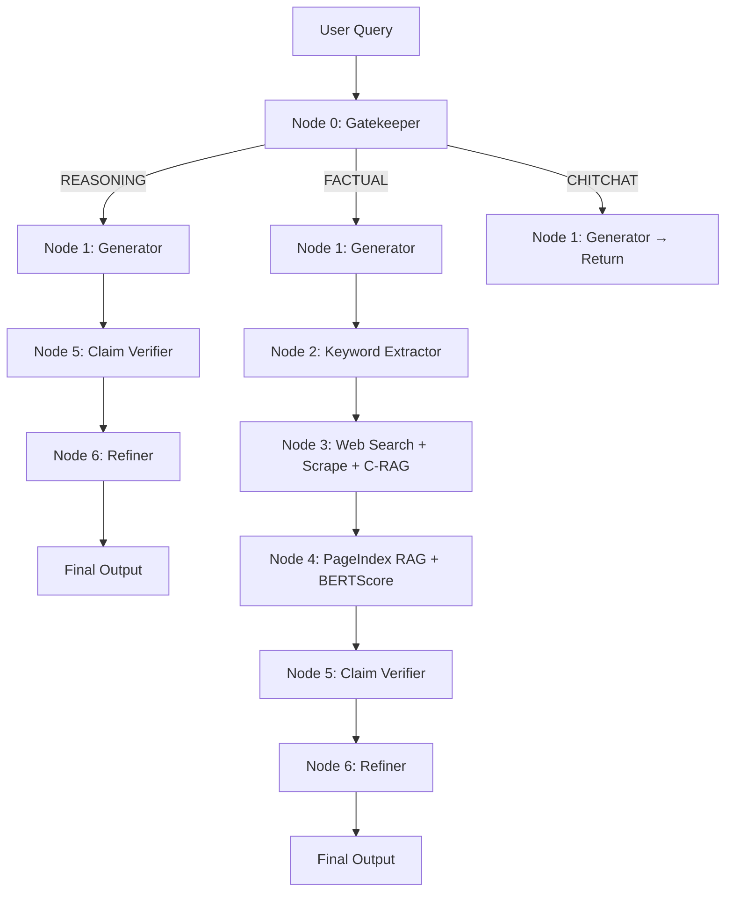

# 🔍 Hallu-Check

**An agentic multi-hop pipeline for detecting and correcting LLM hallucinations at the claim level.**

Hallu-Check takes any natural-language query, generates an answer using a small LLM, independently retrieves factual evidence from the web, verifies **each individual claim** against that evidence using NLI, and — if hallucinations are found — rewrites only the incorrect claims using a stronger model.

---

## ✨ Features

- **Claim-Level Verification** — Extracts atomic claims and verifies each independently (SUPPORTED / CONTRADICTED / UNVERIFIABLE)
- **Semantic Gatekeeper** — Routes queries intelligently: FACTUAL → full pipeline, REASONING → logic check, CHITCHAT → instant response
- **Corrective RAG (C-RAG)** — Evaluates every scraped chunk for relevance; rewrites search queries automatically if nothing useful is found
- **Vectorless RAG** — Uses [PageIndex](https://github.com/VectifyAI/PageIndex) tree-based reasoning instead of embeddings — no FAISS, no Chroma, no chunking
- **Depth-2 Crawling** — Follows secondary links from primary pages with strict semantic keyword filtering
- **Honest Uncertainty Detection** — Distinguishes "I don't know" from fabrication (zero API cost)
- **Login-Wall Blocking** — Automatically skips unscrapable domains (Facebook, Instagram, etc.) and detects boilerplate content
- **Route-Aware Refinement** — Factual queries get a strict editor; code/logic queries get a Senior SWE tutor

---

## 🏗️ Architecture



### Three Routes

| Route | Path | When |
|-------|------|------|
| **FACTUAL** | 0 → 1 → 2 → 3 → 4 → 5 → 6 → 7 | Facts about people, places, events |
| **REASONING** | 0 → 1 → 5 → 6 → 7 | Code, math, logic (skip web search) |
| **CHITCHAT** | 0 → 1 → 7 | Greetings, small talk (return immediately) |

---

## ⚙️ How It Works

```
Query: "Who is the Chief Minister of Andhra Pradesh?"
              │
    ┌── Node 0: Gatekeeper ──────────────────────┐
    │  Heuristic regex → "who is X" → FACTUAL    │
    └─────────────┬──────────────────────────────┘
              │
    ┌── Node 1: Llama 3.2-1B ───────────────────┐
    │  Generates preliminary answer               │
    └─────────────┬──────────────────────────────┘
              │
    ┌── Node 2: Keyword Extractor ───────────────┐
    │  "chief minister andhra pradesh"            │
    └─────────────┬──────────────────────────────┘
              │
    ┌── Node 3: Web Search + Scrape ─────────────┐
    │  DuckDuckGo → 6+ URLs scraped              │
    │  C-RAG filters irrelevant chunks            │
    │  Depth-2 crawls secondary links             │
    │  Markdown saved to /tmp/hallu-check/*.md    │
    └─────────────┬──────────────────────────────┘
              │
    ┌── Node 4: PageIndex RAG ───────────────────┐
    │  Tree-index built from markdown             │
    │  LLM reasons over tree → selects nodes      │
    │  BERTScore: LLM output vs RAG context       │
    └─────────────┬──────────────────────────────┘
              │
    ┌── Node 5: Claim Verifier (Gemini) ─────────┐
    │  Extracts atomic claims                     │
    │  NLI per claim vs RAG context               │
    │  Score = 0.7×claims + 0.3×(1−BERTScore)    │
    └─────────────┬──────────────────────────────┘
              │
         hallucination?
           /         \
         YES          NO
          │            │
    ┌── Node 6 ──┐     │
    │  Fix bad   │     │
    │  claims    │     │
    └─────┬──────┘     │
          └──────┬─────┘
                 │
           Final Answer
```

---

## 🚀 Setup

### Prerequisites

- Python 3.10+
- [HuggingFace API Token](https://huggingface.co/settings/tokens) (free)
- [Google Gemini API Key](https://aistudio.google.com/app/apikey) (free tier)

### Installation

```bash
git clone https://github.com/Suhas-123-cell/Hallu-Check.git
cd Hallu-Check

python -m venv .venv
source .venv/bin/activate

pip install -r requirements.txt
```

### Configuration

Create a `.env` file in the project root:

```env
HF_API_TOKEN=your_huggingface_token
LOCAL_MODEL_ID=meta-llama/Llama-3.2-1B-Instruct

GEMINI_API_KEY=your_gemini_api_key
GEMINI_MODEL=gemini-2.5-flash
```

---

## 💻 Usage

### Start the Server

```bash
uvicorn main:app --reload
```

### Interactive CLI

```bash
python test_cli.py
```

```
══════════════════════════════════════════════════════
  🔍 Hallu-Check v2.0 — Claim-Level Hallucination Detection
══════════════════════════════════════════════════════

  📝 Enter your query (type or paste, then press Ctrl+D to submit):
  Who is the current PM of India?

  ✅ Pipeline completed in 18.3s
  🔍 Route: FACTUAL

  📋 Claim-by-Claim Analysis:
  ✅ [SUPPORTED] (conf: 95%)
     Claim: Narendra Modi is the current Prime Minister of India.
     Evidence: Multiple sources confirm Modi as PM since 2014.

  🎯 Hallucination Score: [░░░░░░░░░░░░░░░░░░░░░░░░] 0.04
     Status: NO HALLUCINATION
```

### API

```bash
curl -X POST http://localhost:8000/generate \
  -H "Content-Type: application/json" \
  -d '{"query": "Who is the current PM of India?"}'
```

**Response:**
```json
{
  "query": "Who is the current PM of India?",
  "query_category": "FACTUAL",
  "llm_output": "...",
  "rag_output": "...",
  "bertscore": {"precision": 0.85, "recall": 0.82, "f1": 0.83},
  "claim_verdicts": [
    {
      "claim": "Narendra Modi is the PM of India",
      "verdict": "SUPPORTED",
      "evidence": "...",
      "confidence": 0.95,
      "reasoning": "..."
    }
  ],
  "hallucination_score": 0.04,
  "hallucination_detected": false,
  "final_answer": "..."
}
```

---

## 📁 Project Structure

```
hallu-check/
├── main.py                    # FastAPI app — pipeline orchestration
├── config.py                  # .env loader → typed constants
├── test_cli.py                # Interactive CLI client
├── requirements.txt
│
├── nodes/
│   ├── gatekeeper.py          # Node 0 — Query classification (heuristic + LLM)
│   ├── generator.py           # Node 1 — Llama 3.2-1B answer generation
│   ├── web_search.py          # Nodes 2+3 — Keywords, search, scrape, C-RAG
│   ├── pageindex_rag.py       # Node 4 — Vectorless RAG + BERTScore
│   ├── claim_verifier.py      # Node 5 — Claim-level NLI verification
│   └── refiner.py             # Node 6 — Evidence-based correction
│
└── PageIndex/                 # Vendored VectifyAI/PageIndex library
    └── pageindex/             # Core: md_to_tree(), tree search, utils
```

---

## 🧠 Models Used

| Component | Model | Provider | Purpose |
|-----------|-------|----------|---------|
| Gatekeeper | Llama 3.2-1B | HuggingFace API | Query classification |
| Generator | Llama 3.2-1B | HuggingFace API | Preliminary answer |
| Keyword Extractor | Llama 3.2-1B | HuggingFace API | Search term distillation |
| C-RAG Evaluator | Llama 3.2-1B | HuggingFace API | Chunk relevance filter |
| PageIndex Tree Search | Llama 3.2-1B | HuggingFace API | Node selection reasoning |
| Claim Verifier | Gemini 2.5 Flash | Google AI Studio | NLI verification |
| Refiner | Gemini 2.5 Flash | Google AI Studio | Evidence-based correction |

> **Design choice:** Llama 3.2-1B (1B params) is intentionally small — it's the "test subject" that's likely to hallucinate. Gemini 2.5 Flash is the "judge" that catches and fixes those hallucinations.

---

## 🔑 Key Design Decisions

| Decision | Rationale |
|----------|-----------|
| **Vectorless RAG** (PageIndex) | No embeddings, no vector DB — LLM reasons over document tree structure directly |
| **Single Gemini call** for verification | Batches claim extraction + NLI in one prompt to minimize API usage on free tier |
| **Dual-model architecture** | Cheap LLM (Llama 1B) generates, powerful LLM (Gemini 2.5) judges and corrects |
| **C-RAG with auto query rewrite** | Doesn't blindly trust retrieved content — filters irrelevant chunks and retries with rewritten queries |
| **Honest uncertainty detection** | Zero-cost regex pre-filter distinguishes "I don't know" from fabrication before calling Gemini |
| **Depth-2 crawling** | Follows secondary links with strict keyword filtering for richer context without bloat |
| **BERTScore as secondary signal** | 30% weight in hallucination score alongside claim-level NLI as a safety net |
| **UUID-based temp files** | Concurrent-safe markdown storage for parallel pipeline runs |

---

## 📦 Dependencies

| Dependency | Purpose |
|------------|---------|
| FastAPI + Uvicorn | Web framework & ASGI server |
| `huggingface-hub` | LLM inference (Llama 3.2-1B) |
| `google-genai` | Gemini API (verification + refinement) |
| `ddgs` | DuckDuckGo web search |
| `httpx` + `beautifulsoup4` + `lxml` | Web scraping |
| PageIndex (vendored) | Vectorless tree-index RAG |
| `bert-score` | Semantic similarity metric |
| NLTK | NER + tokenization |
| `tenacity` | Retry logic with backoff |
| `tiktoken` | Token counting for PageIndex |

---

## 📄 License

MIT
