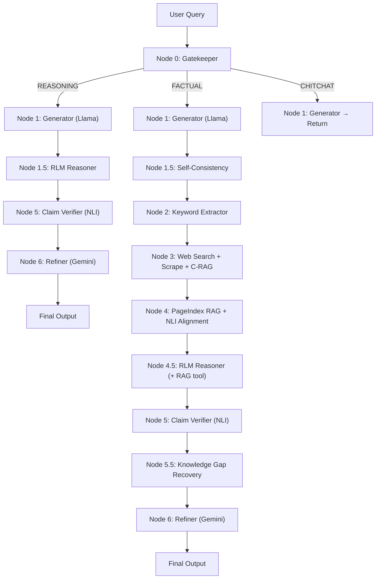

# 🔍 Hallu-Check

**An agentic multi-hop pipeline for detecting and correcting LLM hallucinations at the claim level — with recursive reasoning, self-consistency verification, and trained NLI classification.**

Hallu-Check takes any natural-language query, generates an answer using a small LLM (Llama 3.2-1B), independently retrieves factual evidence from the web, verifies **each individual claim** against that evidence using a fine-tuned DeBERTa-v3 NLI model, and — if hallucinations are found — rewrites only the incorrect claims using a stronger model (Gemini 2.5 Flash). For complex reasoning queries, a **Recursive Language Model (RLM)** decomposes multi-step problems into isolated sub-questions, solving each in a fresh context to prevent working-memory loss.

---

## ✨ Features

### Core Pipeline
- **Claim-Level Verification** — Extracts atomic claims and verifies each independently (SUPPORTED / CONTRADICTED / UNVERIFIABLE)
- **Semantic Gatekeeper** — Routes queries intelligently: FACTUAL → full pipeline, REASONING → logic check, CHITCHAT → instant response
- **Corrective RAG (C-RAG)** — Evaluates every scraped chunk for relevance; rewrites search queries automatically if nothing useful is found
- **Vectorless RAG** — Uses [PageIndex](https://github.com/VectifyAI/PageIndex) tree-based reasoning instead of embeddings — no FAISS, no Chroma, no chunking
- **Depth-2 Crawling** — Follows secondary links from primary pages with strict semantic keyword filtering
- **Knowledge Gap Recovery** — Automatically runs targeted supplementary searches for UNVERIFIABLE claims before refinement

### Advanced Reasoning
- **Recursive Language Model (RLM)** — Decomposes complex queries into 2–4 atomic sub-questions, solves each in a fresh isolated context (parallel), and recomposes the final answer — reducing working-memory hallucinations in small models *(MIT RLM, arXiv 2025)*
- **Python Execution Tool** — RLM leaves can emit `<python>` blocks for arithmetic/algebra/combinatorics; executed in a sandboxed subprocess instead of computing token-by-token
- **RAG Tool for RLM** — On FACTUAL queries, RLM leaves can emit `<rag>` blocks to query the same pre-built PageIndex tree — zero web re-scrape cost
- **Self-Consistency Checking** — Generates multiple answers at varied temperatures and measures agreement via pairwise NLI entailment

### Verification & Calibration
- **Fine-Tuned DeBERTa-v3 NLI Model** — Trained on Multi-Genre NLI (MNLI) for deterministic, calibrated claim verification (~50ms per claim on MPS)
- **Platt Scaling Calibration** — Logistic regression on NLI logits ensures confidence scores are properly calibrated (0.8 confidence ≈ 80% accuracy)
- **NLI-Based Alignment Scoring** — Replaces BERTScore with entailment-based semantic alignment (catches "Modi is President" vs "Modi is PM" — BERTScore can't)
- **Honest Uncertainty Detection** — Distinguishes "I don't know" from fabrication (zero API cost, regex-based)
- **Route-Aware Refinement** — Factual queries get a strict evidence editor; code/logic queries get a Senior SWE tutor

### Infrastructure
- **Login-Wall Blocking** — Automatically skips unscrapable domains (Facebook, Instagram, etc.) and detects boilerplate content
- **UUID-Based Temp Files** — Concurrent-safe markdown storage for parallel pipeline runs
- **Gemini Rate-Limit Retry** — Parses `retryDelay` from 429 responses for precise backoff on the free tier

---

## 🏗️ Architecture



### Three Routes

| Route | Path | When |
|-------|------|------|
| **FACTUAL** | 0 → 1 → 1.5(SC) → 2 → 3 → 4 → 4.5(RLM) → 5 → 5.5 → 6 → 7 | Facts about people, places, events |
| **REASONING** | 0 → 1 → 1.5(RLM) → 5 → 6 → 7 | Code, math, logic (skip web search) |
| **CHITCHAT** | 0 → 1 → 7 | Greetings, small talk (return immediately) |

---

## ⚙️ How It Works

```
Query: "Who is the Chief Minister of Andhra Pradesh?"
              │
    ┌── Node 0: Gatekeeper ──────────────────────┐
    │  Heuristic regex → "who is X" → FACTUAL    │
    └─────────────┬──────────────────────────────┘
              │
    ┌── Node 1: Llama 3.2-1B ───────────────────┐
    │  Generates preliminary answer               │
    └─────────────┬──────────────────────────────┘
              │
    ┌── Node 1.5: Self-Consistency ──────────────┐
    │  3 answers @ temps [0.1, 0.5, 0.9]         │
    │  Pairwise NLI → consistency_score           │
    └─────────────┬──────────────────────────────┘
              │
    ┌── Node 2: Keyword Extractor ───────────────┐
    │  "chief minister andhra pradesh"            │
    └─────────────┬──────────────────────────────┘
              │
    ┌── Node 3: Web Search + Scrape ─────────────┐
    │  DuckDuckGo → 6+ URLs scraped              │
    │  C-RAG filters irrelevant chunks            │
    │  Depth-2 crawls secondary links             │
    │  Markdown saved to /tmp/hallu-check/*.md    │
    └─────────────┬──────────────────────────────┘
              │
    ┌── Node 4: PageIndex RAG ───────────────────┐
    │  Tree-index built from markdown             │
    │  LLM reasons over tree → selects nodes      │
    │  NLI alignment: LLM output vs RAG context   │
    └─────────────┬──────────────────────────────┘
              │
    ┌── Node 4.5: RLM Reasoner (optional) ───────┐
    │  Decompose → 2-4 sub-questions              │
    │  Each leaf can use <rag> and <python> tools  │
    │  Compose final answer from sub-answers       │
    └─────────────┬──────────────────────────────┘
              │
    ┌── Node 5: Claim Verifier ──────────────────┐
    │  Gemini extracts atomic claims               │
    │  DeBERTa NLI verifies each vs RAG context   │
    │  Score = 0.7×claims + 0.3×(1−NLI alignment) │
    └─────────────┬──────────────────────────────┘
              │
    ┌── Node 5.5: Knowledge Gap Recovery ────────┐
    │  UNVERIFIABLE claims → targeted search      │
    │  Enriches RAG context before refinement     │
    └─────────────┬──────────────────────────────┘
              │
         hallucination?
           /         \
         YES          NO
          │            │
    ┌── Node 6 ──┐     │
    │  Fix bad   │     │
    │  claims    │     │
    └─────┬──────┘     │
          └──────┬─────┘
                 │
           Final Answer
```

---

## 🚀 Setup

### Prerequisites

- Python 3.10+
- [HuggingFace API Token](https://huggingface.co/settings/tokens) (free)
- [Google Gemini API Key](https://aistudio.google.com/app/apikey) (free tier)

### Installation

```bash
git clone https://github.com/Suhas-123-cell/Hallu-Check.git
cd Hallu-Check

python -m venv .venv
source .venv/bin/activate

pip install -r requirements.txt
```

### Configuration

Create a `.env` file in the project root:

```env
HF_API_TOKEN=your_huggingface_token
LOCAL_MODEL_ID=meta-llama/Llama-3.2-1B-Instruct

GEMINI_API_KEY=your_gemini_api_key
GEMINI_MODEL=gemini-2.5-flash

# ── Optional Toggles ──
ENABLE_SELF_CONSISTENCY=true       # Self-consistency checking (default: true)
ENABLE_RLM_REASONING=true          # Recursive Language Model reasoner (default: true)
USE_NLI_MODEL=true                 # Use trained DeBERTa NLI model (default: true)
HALLUCINATION_THRESHOLD=0.3        # Scores above this trigger refinement
N_CONSISTENCY_SAMPLES=3            # Number of self-consistency samples
```

### Train the NLI Model (Optional — Recommended)

```bash
# Auto-downloads MNLI from HuggingFace Hub
python train_nli.py

# Or with custom settings (e.g. on Colab with GPU)
python train_nli.py --batch-size 16 --gradient-accumulation-steps 2 --device cuda
```

The trained model is saved to `models/nli-deberta-v3-mnli/final/` and is automatically loaded by the pipeline.

---

## 💻 Usage

### Start the Server

```bash
uvicorn main:app --reload
```

### Interactive CLI

```bash
python test_cli.py
```

```
══════════════════════════════════════════════════════
  🔍 Hallu-Check v3.0 — Claim-Level Hallucination Detection
══════════════════════════════════════════════════════

  📝 Enter your query (type or paste, then press Ctrl+D to submit):
  Who is the current PM of India?

  ✅ Pipeline completed in 18.3s
  🔍 Route: FACTUAL

  📋 Claim-by-Claim Analysis:
  ✅ [SUPPORTED] (conf: 95%)
     Claim: Narendra Modi is the current Prime Minister of India.
     Evidence: Multiple sources confirm Modi as PM since 2014.

  🎯 Hallucination Score: [░░░░░░░░░░░░░░░░░░░░░░░░] 0.04
     Status: NO HALLUCINATION
```

### API

```bash
curl -X POST http://localhost:8000/generate \
  -H "Content-Type: application/json" \
  -d '{"query": "Who is the current PM of India?"}'
```

**Response:**
```json
{
  "query": "Who is the current PM of India?",
  "query_category": "FACTUAL",
  "llm_output": "...",
  "rag_output": "...",
  "bertscore": {"precision": 0.85, "recall": 0.82, "f1": 0.83, "alignment_score": 0.83, "method": "nli"},
  "claim_verdicts": [
    {
      "claim": "Narendra Modi is the PM of India",
      "verdict": "SUPPORTED",
      "evidence": "...",
      "confidence": 0.95,
      "reasoning": "NLI model classified with P(entailment)=0.950, P(neutral)=0.030, P(contradiction)=0.020"
    }
  ],
  "hallucination_score": 0.04,
  "hallucination_detected": false,
  "hallucination_summary": "...",
  "verification_method": "nli",
  "final_answer": "..."
}
```

---

## 📁 Project Structure

```
hallu-check/
├── main.py                           # FastAPI app — pipeline orchestration (v3.0)
├── config.py                         # .env loader → typed constants + feature flags
├── test_cli.py                       # Interactive CLI client
├── requirements.txt                  # Pinned dependencies
├── train_nli.py                      # Fine-tune DeBERTa-v3-base on MNLI
│
├── nodes/
│   ├── gatekeeper.py                 # Node 0 — Query classification (heuristic + LLM)
│   ├── generator.py                  # Node 1 — Llama 3.2-1B answer generation
│   ├── self_consistency.py           # Node 1.5 — Multi-temperature consistency via NLI
│   ├── recursive_reasoner.py         # Node 1.5/4.5 — RLM: decompose → solve → compose
│   ├── web_search.py                 # Nodes 2+3 — Keywords, search, scrape, C-RAG, depth-2
│   ├── pageindex_rag.py              # Node 4 — Vectorless RAG + NLI alignment scoring
│   ├── claim_verifier.py             # Node 5 — Claim extraction (Gemini) + NLI verification
│   ├── nli_model.py                  # DeBERTa-v3 singleton — batch NLI classification
│   ├── calibration.py                # Platt scaling for NLI confidence calibration
│   ├── refiner.py                    # Node 6 — Route-aware evidence-based correction (Gemini)
│   └── tools/
│       └── python_exec.py            # Sandboxed Python executor for RLM computation leaves
│
├── benchmarks/
│   ├── eval_truthfulqa.py            # NLI model benchmark on TruthfulQA
│   ├── eval_halueval.py              # NLI model benchmark on HaluEval
│   ├── results_truthfulqa.json       # TruthfulQA results (98.5% detection rate)
│   └── results_halueval.json         # HaluEval results (73.8% recall, 58.9% F1)
│
├── models/
│   └── nli-deberta-v3-mnli/          # Trained NLI model checkpoint
│       └── final/                    # Best model + tokenizer + label mapping
│
├── PageIndex/                        # Vendored VectifyAI/PageIndex library
│   └── pageindex/                    # Core: md_to_tree(), tree search, utils
│
└── logs/                             # Pipeline execution logs
```

---

## 🧠 Models Used

| Component | Model | Provider | Purpose |
|-----------|-------|----------|---------|
| Gatekeeper | Llama 3.2-1B-Instruct | HuggingFace API | Query classification |
| Generator | Llama 3.2-1B-Instruct | HuggingFace API | Preliminary answer |
| RLM Reasoner | Llama 3.2-1B-Instruct | HuggingFace API | Recursive decompose/solve/compose |
| Self-Consistency | Llama 3.2-1B-Instruct | HuggingFace API | Multi-temperature sampling |
| Keyword Extractor | Llama 3.2-1B-Instruct | HuggingFace API | Search term distillation |
| C-RAG Evaluator | Llama 3.2-1B-Instruct | HuggingFace API | Chunk relevance filter |
| PageIndex Tree Search | Llama 3.2-1B-Instruct | HuggingFace API | Node selection reasoning |
| **NLI Verifier** | **DeBERTa-v3-base** | **Local (fine-tuned)** | **Claim verification (~50ms/claim)** |
| Claim Extractor | Gemini 2.5 Flash | Google AI Studio | Atomic claim decomposition |
| Refiner | Gemini 2.5 Flash | Google AI Studio | Evidence-based correction |

> **Design philosophy:** Llama 3.2-1B (1B params) is intentionally small — it's the "test subject" that's likely to hallucinate. DeBERTa-v3 (86M params, trained on MNLI) provides fast, deterministic NLI verification. Gemini 2.5 Flash is the "editor" that extracts claims and corrects hallucinations.

---

## 🔄 Recursive Language Model (RLM) — Deep Dive

The RLM reasoner (`nodes/recursive_reasoner.py`) implements the MIT RLM pattern (arXiv 2025):

```
Query: "What is 17 × 23 + the population of France in millions?"
                        │
              ┌─── DECOMPOSE ───┐
              │  Llama breaks    │
              │  into 2-4 sub-Qs│
              └────────┬────────┘
                       │
          ┌────────────┼────────────┐
          ▼            ▼            ▼
    ┌───────────┐┌───────────┐┌───────────┐
    │  Sub-Q 1  ││  Sub-Q 2  ││  Sub-Q 3  │  ← parallel, isolated contexts
    │ 17 × 23   ││ population││ add them  │
    │ <python>  ││ <rag>     ││           │
    │ print(391)││ "67.75M"  ││           │
    └─────┬─────┘└─────┬─────┘└─────┬─────┘
          └────────────┼────────────┘
                       ▼
              ┌─── COMPOSE ────┐
              │  Synthesize    │
              │  final answer  │
              │  from sub-As   │
              └────────────────┘
```

**Why this helps:** Llama 3.2-1B's main failure mode is working-memory loss across multi-step problems. Isolating each sub-step in its own fresh context window dramatically reduces that failure mode — at **zero extra paid API cost** (only free HuggingFace inference).

**Two tool modes:**
- `<python>` — Sandboxed subprocess with math/sympy/itertools pre-imported; 5s timeout
- `<rag>` — Queries the shared PageIndex tree (FACTUAL route only); no web re-scrape

---

## 📊 Benchmark Results

### TruthfulQA
| Metric | Value |
|--------|-------|
| Samples | 200 |
| Misconceptions Detected | 197 / 200 |
| **Detection Rate** | **98.5%** |
| Speed | 41.8ms / sample |

### HaluEval-QA
| Metric | Value |
|--------|-------|
| Samples | 500 |
| Precision | 49.0% |
| **Recall** | **73.8%** |
| **F1** | **58.9%** |
| Accuracy | 48.0% |
| Speed | 27.8ms / sample |

> **Note:** HaluEval precision is lower because the NLI model aggressively flags uncertain claims as non-supported — a conservative design choice that prioritises catching hallucinations over avoiding false alarms.

---

## 🔑 Key Design Decisions

| Decision | Rationale |
|----------|-----------|
| **Vectorless RAG** (PageIndex) | No embeddings, no vector DB — LLM reasons over document tree structure directly |
| **Hybrid verification** (NLI + Gemini) | Gemini extracts claims (LLMs excel at decomposition), DeBERTa verifies (deterministic, fast, no sycophancy) |
| **Recursive Language Model** | Isolates sub-steps in fresh contexts to prevent working-memory loss in small models — zero extra paid cost |
| **Self-consistency checking** | Multi-temperature sampling + pairwise NLI detects instability before full pipeline runs |
| **NLI alignment over BERTScore** | BERTScore measures word similarity, not factual correctness. NLI catches semantic contradictions |
| **Platt scaling calibration** | Raw NLI softmax is overconfident; logistic regression on logits produces properly calibrated probabilities |
| **Dual-model architecture** | Cheap LLM (Llama 1B) generates, DeBERTa (86M) verifies, powerful LLM (Gemini 2.5) extracts and corrects |
| **C-RAG with auto query rewrite** | Doesn't blindly trust retrieved content — filters irrelevant chunks and retries with rewritten queries |
| **Knowledge gap recovery** (Node 5.5) | UNVERIFIABLE claims trigger targeted supplementary searches before giving up |
| **Python executor for RLM** | Small models hallucinate numbers; Python doesn't. Sandboxed subprocess with 5s timeout |
| **Honest uncertainty detection** | Zero-cost regex pre-filter distinguishes "I don't know" from fabrication before calling any model |
| **Depth-2 crawling** | Follows secondary links with strict keyword filtering for richer context without bloat |
| **UUID-based temp files** | Concurrent-safe markdown storage for parallel pipeline runs |

---

## 📦 Dependencies

| Dependency | Purpose |
|------------|---------|
| FastAPI + Uvicorn | Web framework & ASGI server |
| `huggingface-hub` | LLM inference (Llama 3.2-1B) |
| `google-genai` | Gemini API (claim extraction + refinement) |
| `transformers` + `torch` | DeBERTa-v3 NLI model (local inference) |
| `ddgs` | DuckDuckGo web search |
| `httpx` + `beautifulsoup4` + `lxml` | Web scraping |
| PageIndex (vendored) | Vectorless tree-index RAG |
| `datasets` + `accelerate` | NLI model training (MNLI dataset) |
| `scikit-learn` | Platt scaling calibration + metrics |
| NLTK | NER + tokenization |
| `tenacity` | Retry logic with backoff |
| `tiktoken` | Token counting for PageIndex |

---

## 📄 License

MIT
