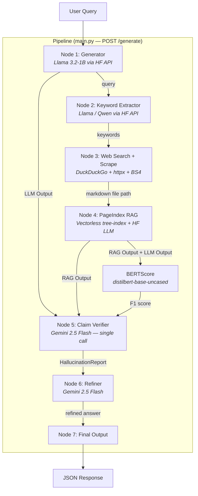

# Hallu-Check — Project Structure Analysis

## Overview

**Hallu-Check** is a claim-level LLM hallucination detection pipeline exposed as a FastAPI web service. Given a user query, it generates an answer via a small LLM (Llama 3.2-1B), independently retrieves factual evidence from the web, verifies each factual claim against that evidence, and — if hallucinations are found — rewrites only the incorrect claims using a stronger model (Gemini 2.5 Flash).

---

## Architecture Diagram



---

## Directory Layout

```
hallu-check/
├── .env                      # API keys (HF_API_TOKEN, GEMINI_API_KEY, etc.)
├── config.py                 # Loads .env → typed constants
├── main.py                   # FastAPI app — wires Nodes 1–7 into POST /generate
├── test_cli.py               # Interactive CLI client for testing the API
├── DEPTH2_CRAWLING.py         # Standalone reference/prototype for depth-2 crawling logic
├── requirements.txt           # Python dependencies
├── pyproject.toml
│
├── nodes/                    # ← Pipeline node implementations
│   ├── generator.py           #    Node 1 — Llama 3.2-1B answer generation (HF Inference API)
│   ├── web_search.py          #    Nodes 2 & 3 — Keyword extraction + DuckDuckGo search/scrape
│   ├── pageindex_rag.py       #    Node 4 — PageIndex tree-index + tree-search retrieval + BERTScore
│   ├── claim_verifier.py      #    Node 5 — Claim extraction + NLI verification (Gemini)
│   └── refiner.py             #    Node 6 — Evidence-based refinement (Gemini)
│
├── PageIndex/                # ← Vendored third-party library (VectifyAI/PageIndex)
│   ├── pageindex/             #    Core library: md_to_tree(), utils, etc.
│   ├── run_pageindex.py       #    Standalone runner (not used by pipeline)
│   ├── cookbook/               #    Official examples
│   └── examples/
│
└── logs/                     # Stale/legacy JSON logs
```

---

## File-by-File Breakdown

### Core Files

| File | Lines | Role |
|------|-------|------|
| [main.py](file:///Users/suhasdev/Documents/hallu-check/main.py) | 257 | FastAPI app. Defines `POST /generate` and `GET /health`. Wires nodes 1→7 sequentially with `asyncio.to_thread()` for blocking calls. |
| [config.py](file:///Users/suhasdev/Documents/hallu-check/config.py) | 35 | Loads `.env` via `python-dotenv`. Exports typed constants: `HF_API_TOKEN`, `GEMINI_API_KEY`, `GEMINI_MODEL`, `SEARCH_MAX_RESULTS`, `SCRAPED_MD_PATH`, `HALLUCINATION_THRESHOLD`. |
| [test_cli.py](file:///Users/suhasdev/Documents/hallu-check/test_cli.py) | 197 | Interactive REPL that POSTs queries to `localhost:8000/generate` and pretty-prints per-claim verdicts with colored terminal output. |

### Pipeline Nodes (`nodes/`)

#### Node 1 — [generator.py](file:///Users/suhasdev/Documents/hallu-check/nodes/generator.py) (151 lines)

- **`generate_llm_output(query)`** — Calls Llama 3.2-1B via HuggingFace Inference API (serverless). Returns raw preliminary answer.
- **`generate_llm_output_with_context(query, context)`** — Context-grounded variant used during refinement. Imports config for `HF_API_TOKEN` and `QWEN_MODEL_ID`.
- Uses `tenacity` retry (3 attempts, exponential backoff).

#### Nodes 2 & 3 — [web_search.py](file:///Users/suhasdev/Documents/hallu-check/nodes/web_search.py) (1081 lines — largest file)

This is the most complex module. Contains:

| Function | Purpose |
|----------|---------|
| `extract_keywords(query)` | **Node 2.** Short queries → direct words. Longer → LLM-based extraction with name preservation. |
| `search_and_scrape(keywords, enable_depth2, query)` | **Node 3 entry point.** Dispatches to depth-1 or depth-2 crawling. |
| `_web_search(keywords, max_results, query)` | DuckDuckGo search with recency scoring, fallback strategies, LinkedIn for person queries. |
| `_scrape_url(url)` / `_fetch_html(url)` | HTTP fetch with random User-Agents, SSL bypass, Jina mirror fallback. |
| `extract_links()` / `filter_links_by_keywords()` | Depth-2: extract `<a>` tags, strict semantic filter. |
| `crawl_secondary_content()` | Depth-2: follow filtered secondary links, concurrent scraping. |
| `_build_markdown()` / `_build_markdown_with_depth2()` | Assemble scraped content into Markdown for PageIndex ingestion. |

**Supporting pieces:**
- `extract_entities()` — NLTK-based NER (PERSON, LOCATION, etc.)
- `_wants_recent_info()` — Heuristic for time-sensitive queries
- `_score_result_recency()` — Recency/domain-relevance scoring

#### Node 4 — [pageindex_rag.py](file:///Users/suhasdev/Documents/hallu-check/nodes/pageindex_rag.py) (439 lines)

- **Monkey-patches** PageIndex's LLM layer (`llm_completion`, `llm_acompletion`, `count_tokens`) to use HuggingFace instead of OpenAI.
- **`build_tree_index(md_path)`** — Calls `md_to_tree()` to build a hierarchical tree from the scraped Markdown.
- **`tree_search_retrieve(tree, query)`** — Strips `text` fields from a copy of the tree, sends the lightweight structure + query to the LLM, which returns relevant `node_id`s as JSON. The original text from those nodes becomes the RAG output.
- **`evaluate_bertscore(candidate, reference)`** — Computes BERTScore (P/R/F1) between LLM output and RAG context using `distilbert-base-uncased`. Fallback: Jaccard word overlap.
- **`run_pageindex_rag_with_bertscore()`** — Combined API: tree build + retrieval + BERTScore.

#### Node 5 — [claim_verifier.py](file:///Users/suhasdev/Documents/hallu-check/nodes/claim_verifier.py) (625 lines)

- **`verify_claims(llm_output, rag_output, query, bertscore_f1)`** — Main entry point.
  1. **Honest uncertainty check** (local regex, zero API calls): if the LLM said "I don't know", checks whether RAG found real content. If yes → `CONTRADICTED`. If no → `HONEST_UNCERTAINTY`.
  2. **Claim extraction + NLI** (single Gemini call): extracts atomic claims and verifies each against RAG context. Returns `SUPPORTED`, `CONTRADICTED`, `UNVERIFIABLE`, or `NO_CLAIM` per claim.
  3. **Scoring**: `0.7 × claim_score + 0.3 × (1 − BERTScore_F1)`. CONTRADICTED weight=1.0, UNVERIFIABLE=0.3.
  4. **Fallback**: keyword-overlap heuristic if Gemini is unavailable.
- Data classes: `ClaimVerdict`, `HallucinationReport`.

#### Node 6 — [refiner.py](file:///Users/suhasdev/Documents/hallu-check/nodes/refiner.py) (218 lines)

- **`refine_with_evidence(query, rag_output, claim_report)`** — Tells Gemini exactly which claims are wrong (with evidence) and asks it to fix only those, preserving correct claims.
- **`refine_response(query, rag_output)`** — Simpler fallback: just answers the question from RAG context.
- Both use Gemini with rate-limit-aware retry (429 handling with `retryDelay` parsing).

### Standalone Reference

| File | Role |
|------|------|
| [DEPTH2_CRAWLING.py](file:///Users/suhasdev/Documents/hallu-check/DEPTH2_CRAWLING.py) | Standalone prototype/reference for depth-2 crawling logic. The *actual* depth-2 code used by the pipeline lives in `nodes/web_search.py`. This file is **not imported** by anything. |

---

## Data Flow (End-to-End)

```
Query: "Who is the Chief Minister of Andhra Pradesh?"
                    │
                    ▼
       ┌─── Node 1: Llama 3.2-1B ───┐
       │  LLM Output: "The CM is..." │
       └─────────────┬───────────────┘
                     │
       ┌─── Node 2: Keyword Extract ──┐
       │  keywords: ["chief minister",│
       │   "andhra pradesh"]           │
       └─────────────┬────────────────┘
                     │
       ┌─── Node 3: DuckDuckGo + Scrape ──────────────┐
       │  → 6+ URLs fetched & scraped                  │
       │  → Depth-2: secondary links crawled           │
       │  → Markdown saved to /tmp/hallu_scraped.md    │
       └─────────────┬────────────────────────────────┘
                     │
       ┌─── Node 4: PageIndex Tree-Index ──────────────┐
       │  → md_to_tree() builds hierarchical index     │
       │  → LLM reasons over tree → selects node_ids   │
       │  → RAG Output = concatenated node texts        │
       │  → BERTScore: LLM Output vs RAG Output         │
       └─────────────┬────────────────────────────────┘
                     │
       ┌─── Node 5: Claim Verifier (Gemini) ───────────┐
       │  → Extracts atomic claims from LLM Output     │
       │  → NLI verification per claim vs RAG context   │
       │  → Score = 0.7*claims + 0.3*(1-BERTScore)     │
       │  → Report: per-claim verdicts + overall score  │
       └─────────────┬────────────────────────────────┘
                     │
               hallucination_detected?
              ╱                        ╲
           YES                          NO
            │                            │
   ┌── Node 6: Refiner (Gemini) ──┐     │
   │  Fix CONTRADICTED claims     │     │
   │  Preserve SUPPORTED claims   │     │
   │  → refined final_answer      │     │
   └──────────┬───────────────────┘     │
              │                          │
              └────────┬─────────────────┘
                       │
              ┌── Node 7: Response ──┐
              │  JSON with:          │
              │  • llm_output        │
              │  • rag_output        │
              │  • bertscore         │
              │  • claim_verdicts[]  │
              │  • hallu_score       │
              │  • final_answer      │
              └──────────────────────┘
```

---

## External Dependencies & APIs

| Dependency | Used For | API Key Required? |
|-----------|----------|-------------------|
| HuggingFace Inference API | LLM generation (Llama 3.2-1B) | Yes (`HF_API_TOKEN`) |
| Google Gemini (via `google-genai`) | Claim verification + refinement | Yes (`GEMINI_API_KEY`) |
| DuckDuckGo (`ddgs`) | Web search | No |
| `httpx` + `beautifulsoup4` + `lxml` | Web scraping | No |
| PageIndex (vendored) | Vectorless tree-index RAG | No (uses monkey-patched LLM) |
| `bert-score` | Semantic similarity metric | No |
| NLTK | NER + tokenization | No |
| `tiktoken` | Token counting (for PageIndex) | No |
| Jina Reader (`r.jina.ai`) | Mirror fallback for blocked pages | No |

---

## Key Design Decisions

| Decision | Rationale |
|----------|-----------|
| **Vectorless RAG** (PageIndex tree-index) | Avoids embedding models, FAISS, Chroma — relies on LLM reasoning over tree structure instead |
| **Single Gemini call** for claim verification | Minimizes API usage (free tier); batches extraction + NLI in one prompt |
| **Dual-model architecture** | Cheap LLM (Llama 1B) for generation, powerful LLM (Gemini 2.5) for judgment/refinement |
| **Honest uncertainty detection** (regex) | Zero-cost pre-filter before expensive Gemini call; distinguishes "I don't know" from fabrication |
| **Depth-2 crawling** | Follows secondary links from primary pages with strict semantic filtering to enrich context without bloat |
| **BERTScore as secondary signal** | 30% weight in hallucination score; acts as safety net alongside claim-level NLI |

---

## Notable Observations

> [!NOTE]
> The `.env` shows `QWEN_MODEL_ID=meta-llama/Llama-3.2-1B-Instruct` — the variable is named "Qwen" but actually points to Llama 3.2-1B. This is a naming mismatch from an earlier version when Qwen was used.

> [!NOTE]
> `DEPTH2_CRAWLING.py` at the project root is a **standalone prototype** that is never imported. The live depth-2 crawling code is fully integrated into `nodes/web_search.py` (lines 640–982). The standalone file can be considered dead code.

> [!WARNING]
> `SCRAPED_MD_PATH` defaults to `/tmp/hallu_scraped.md` — this is ephemeral on macOS reboots and could cause issues if the pipeline is interrupted between Node 3 and Node 4.

> [!NOTE]
> The `logs/` directory contains 5 stale JSON files from March 2026 related to a PDF processing feature that appears to have been removed.
